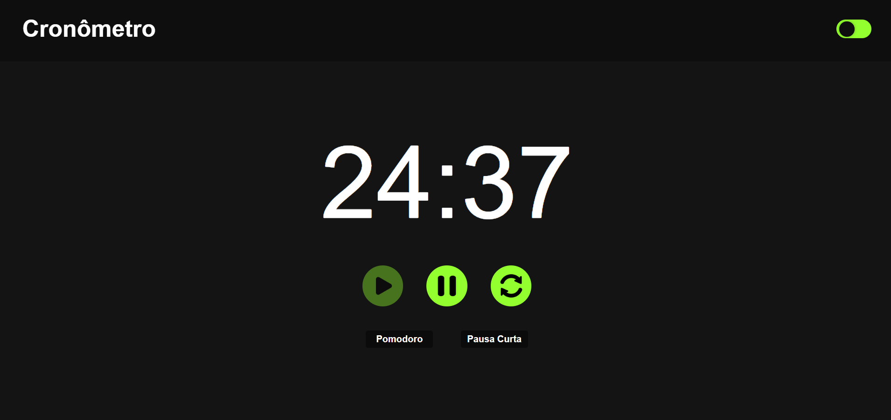
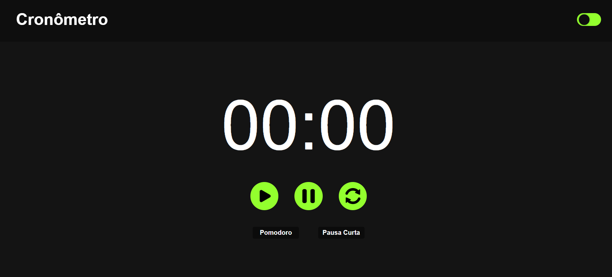
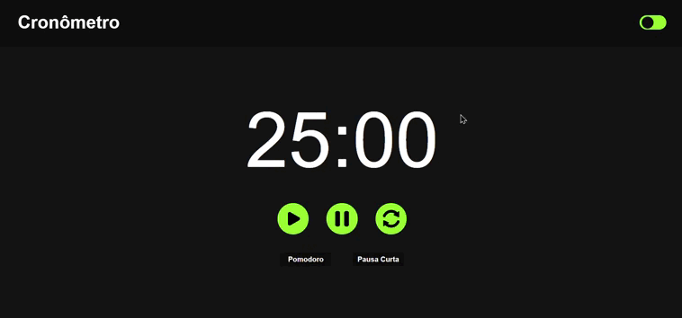

# ⏱️ Projeto 3: Pomodoro – Cronômetro para Estudo

## 📝 Descrição

Este projeto é um cronômetro baseado na **técnica Pomodoro**, que consiste em ciclos de 25 minutos de foco seguidos por pequenas pausas. O objetivo é ajudar a manter a produtividade e a concentração durante sessões de estudo ou trabalho. Desenvolvido com HTML, CSS e JavaScript puros, o projeto implementa um timer regressivo com controles simples e uma interface limpa.

---

## 📸 Imagens

### Timer em contagem



### Tempo encerrado


---

## ⚙️ Funcionalidades

* [x] Timer regressivo de **25:00 minutos**
* [x] Botões de **Iniciar**, **Pausar** e **Resetar**
* [x] Contagem atualizada a cada segundo
* [x] Interface **clara e objetiva**
* [x] **Sem uso de frameworks** (HTML, CSS e JS puros)

---

## ✨ Melhorias Implementadas (opcionais)

* [x] **Sons** ao final do tempo (alerta sonoro)
* [x] **Modo noturno** com botão de alternância (toggle)
* [x] Configuração manual de tempo de **foco** e **pausa**

---

## 🧠 Entendendo o Método Pomodoro

O **Método Pomodoro** é uma técnica de gerenciamento de tempo criada por **Francesco Cirillo** nos anos 1980. O ciclo clássico consiste em:

1. 25 minutos de foco total em uma tarefa
2. 5 minutos de pausa curta
3. Após 4 ciclos, uma pausa mais longa (15-30 minutos)

Essa abordagem ajuda a manter a produtividade sem esgotamento.

---

## 🧩 Lógica de Funcionamento: `setInterval` e `clearInterval`

O timer utiliza a função `setInterval()` para executar a contagem regressiva a cada segundo. Quando o botão "Iniciar" é pressionado, o intervalo começa a reduzir os minutos e segundos.

Exemplo:

```javascript
timer = setInterval(() => {
}, 1000);
```

Para pausar ou resetar o cronômetro, usamos `clearInterval()`:

```javascript
clearInterval(timer);
```

Isso interrompe a execução contínua, permitindo pausar ou reiniciar o timer sem conflitos.

---

## 🎥 Demonstração



---

## 🛠️ Tecnologias Utilizadas

* HTML5
* CSS3
* JavaScript

## 📁 Estrutura de Arquivos

```
projeto-pomodoro/
│
├── index.html
├── style.css
├── script.js
├── img/
│   ├── pause.png
│   ├── play.png
│   └── refresh.png 
└── sounds/
    ├── clock.mp3
    ├── fim.mp3
    ├── pause.mp3
    └── start.mp3
```
